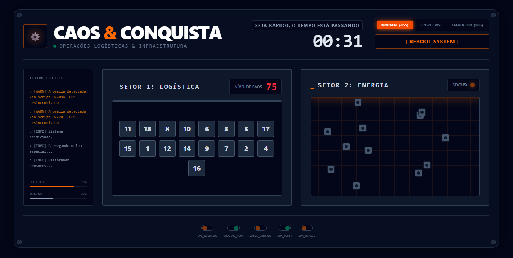
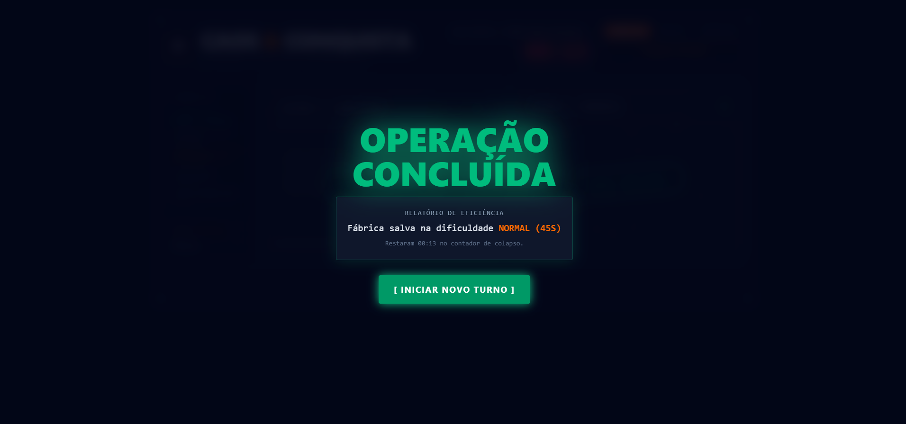

# Caos & Conquista

**Conteúdo da Disciplina**: Dividir e Conquistar 

## Alunos
|Matrícula | Aluno |
| -- | -- |
| 190093625  |  Milena Beatriz Aires de Santana Dias|

## Sobre 
O "Caos & Conquista" é um *serious game* (simulador interativo) focado na gestão sob pressão de operações logísticas e infraestrutura. O jogador assume o papel de uma engenheira que precisa impedir o colapso de uma fábrica estabilizando dois sistemas críticos simultaneamente, antes que o cronômetro reverso zere.

O jogo aplica visualmente dois algoritmos clássicos do paradigma **Dividir e Conquistar** ($\mathcal{O}(N \log N)$):
1. **Contagem de Inversões (Counting Inversions):** Utilizado no Setor de Logística (Esteira). O algoritmo baseado no *Merge Sort* calcula o "Nível de Caos" da linha de produção ao detectar quantas caixas pesadas estão à frente de caixas leves. O jogador deve realizar trocas manuais para zerar as inversões matemáticas.
2. **Par de Pontos Mais Próximos (Closest Pair of Points):** Utilizado no Setor de Energia (Malha). O algoritmo fatia o mapa espacial 2D recursivamente para encontrar os dois geradores que estão mais próximos um do outro (risco de curto-circuito). O jogador deve identificar visualmente e conectar esses dois nós específicos para isolar a rede.

Além disso, o sistema conta com um "Agente Autônomo" que sabota os geradores e a esteira a cada 5 segundos caso os setores ainda não estejam estabilizados.

## Apresentação

_Clique na imagem para abrir o [vídeo](https://youtu.be/BpRfAMgf-Wc)_

## Screenshots

 

 

## Instalação 
**Linguagem**: TypeScript, HTML, CSS 
**Framework**: React (Vite) com Tailwind CSS v4 

**Pré-requisitos:** * Node.js (versão 18 ou superior).
* NPM ou Yarn.

**Passo a passo para rodar localmente:**
1. Clone o repositório em sua máquina:
\`git clone https://github.com/projeto-de-algoritmos-2026/G46_Dividir-e-Conquistar_PA-26.1.git\`

2. Acesse a pasta do projeto:
\`cd G46_Dividir-e-Conquistar_PA-26.1\`

3. Instale as dependências:
\`npm install\`

4. Inicie o servidor de desenvolvimento:
\`npm run dev\`

## Uso 
Após iniciar o servidor local, acesse \`http://localhost:5173\` no seu navegador.

1. Selecione a dificuldade no painel superior (Normal, Tenso ou Hardcore).
2. **Setor 1 (Logística):** Clique em duas caixas para trocá-las de lugar. O objetivo é ordená-las de forma crescente para que o nível de inversões chegue a ZERO.
3. **Setor 2 (Energia):** Analise a malha 2D e clique nos DOIS geradores que estão fisicamente mais próximos um do outro no mapa para conectá-los.
4. Você deve estabilizar ambos os setores antes que o tempo esgote. Cuidado com o Agente Autônomo que bagunçará seu progresso!
